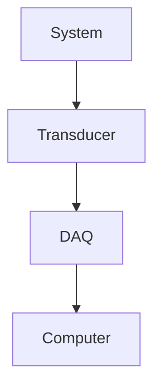

# ASE375 Lecture 1

Why do we make measurements?

- To prove or disprove a theory
- To evaluate a design or predicted performance
- To test if a system is functioning properly

What is a measurement?

- A quantitative comparison between an unknown quantity and a traceable standard

Basic quantities - Mass, Length, time have primary standards: well-defined and internationally accepted

Example: Length standard - 1m platinum-iridium bar (low coefficient of thermal expansion), kept in controlled environment.

That is called a primary standard.

Calibration - Secondary Standard
- Subsequently, length satandard was defined as 1,650,763.73 wacelgnths of Kn^86 to wavelengths of a He-Ne laser.
Most experiments are performed using a computer and a DAQ

Measured quantity from the system, feeds into a sensing element, which feeds into voltage current change element, and then a digitized system

In general, a transducer _removes_ energy from the system

