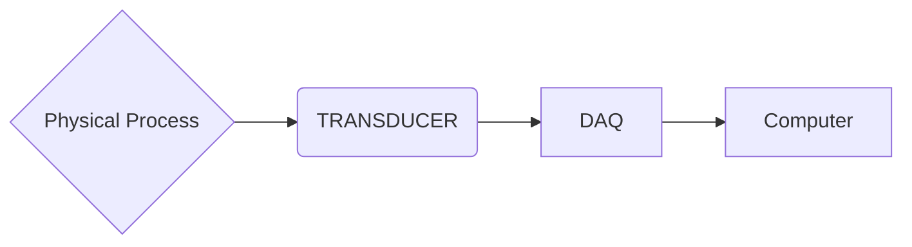

# ASE375 Lecture 3

## Lab 1: Measurements and Uncertainty

- Measure area of the student center (not hallways and doorways)
- Measure the volume and density of a block
- Covered in [[ASE375 Lab Report 1 Notes]].

Uncertainty: a possible value that an error can have. If we recall from the previous lecture [[ASE375 Lecture 2]], the true value and error are not known.

Given a quantity $g = f(x_1, x_2, x_3, \cdots, x_N)$ with $N$ measurements:

$$
\Delta g = \sqrt{(\frac{\partial f}{\partial x_1}\Delta x_1)^2 + (\frac{\partial f}{\partial x_2}\Delta x_2)^2 + \cdots + (\frac{\partial f}{\partial x_N}\Delta x_N)^2}
$$
- In general, precision or random errors usually follow a [[Normal Distribution]]. We want to repeat our measurement using a [[Confidence Interval]].
	- Example: 95% confidence interval means that 95% of the samples will contain the true value.
- If the sample rise is $\infty \rightarrow$ [[Normal Distribution]]

Sample Mean Equation:

$$
\bar{x} = \frac{1}{N}\sum\limits_{i=1}^{N} x_i
$$

Standard Deviation Equation:

$$
\sigma = \sqrt{\frac{\sum\limits_{i=1}^{N} (x_i - \bar{x})^2}{N}}
$$

In reality, we make a finite number of measurements. The sample means are also [[Normal Distribution|Normally Distributed]] with a standard deviation given by $\frac{s_x}{\sqrt{N}}$ where:

$$
s_x = \sqrt{\frac{\sum\limits_{i=1}^{N} (x_i - \bar{x})^2}{N - 1}}
$$

![[ASE375_Lecture3_Sample12.png]]

Let's say $N$ is small, so $< 25$, then that means the distribution will follow a student's [[T Distribution]].

- If $N \rightarrow \infty$, $\mu - 1.96\sigma \leq \bar{x} \leq \mu + 1.96\sigma$ has 95 percent of occurences.
- If $N$ is finite, then we can use the [[T-Statistic]] to define a [[Confidence Interval]].

1. Find $z$ such that: $F(z) = \frac{1}{2}(1 + \gamma)$ where $\gamma\equiv$ [[Confidence Level]], e.g. $95\% \equiv \gamma = 0.95$
	- $F(z) = \frac{1}{2}(1 + 0.95) = 0.975$
2. Find the degrees of freedom $\nu = N - 1$, where $N \equiv \text{Sample Size}$. Set $P = \frac{1 - \gamma}{2}$.
3. Calculate the [[T-Statistic]]:
	- MATLAB: `tinv(p, nu)`
	- Excel: `tinv{2p, nu}`
4. Calculate the sample mean: $\bar{x} = \frac{1}{N}\sum\limits_{i=1}^{N} x_i$
5. Calculate the standard error of the mean: $\frac{S_x}{\sqrt{N}}$
6. Determine the measurement with the confidence interval: $\bar{x} \pm t * \frac{S_x}{\sqrt{N}}$

Data Acquisition - Usually done by a computer

Between the Transducer and the DAQ, some voltage or current is applied. Between the DAQ and the Computer, there is some digitized information in a signal applied.

![[ASE375_Lecture3_AnalogvsDigital.png]]
